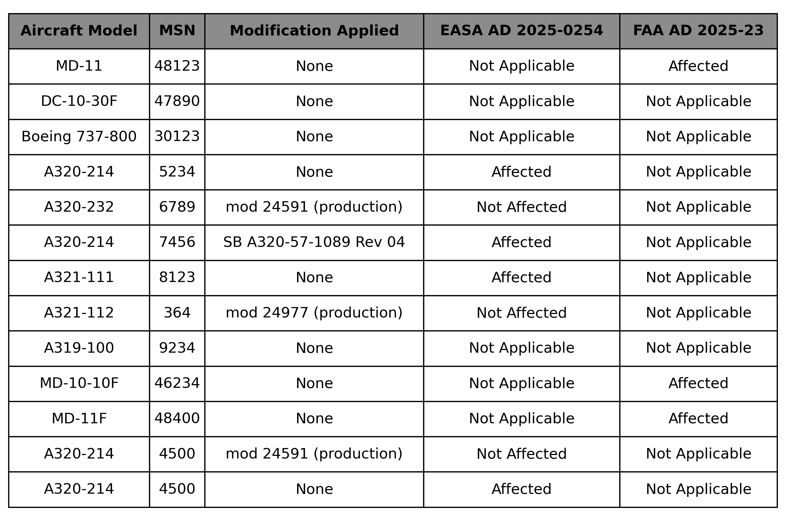

# AD (Airworthiness Directives) Extractor
An extractor for Airworthiness Directives (AD) documents to help extract the important information in ADs.  
This extractor uses an LLM model (LLaMA) that runs on Ollama and LangChain to read and chunk the documents.

## Prerequisites 
- Ollama installed on your system

1. Install Ollama from the official website.
2. Pull the required model:
   ```bash
   ollama pull llama3.1:8b


## How to Run the Project 
1. Install the required dependencies
   ```bash
   pip install -r requirements.txt
2. Add datasets in datasets/docs
3. Run the main script
   ```bash
   python main.py
4. To test given AD's run 
   ```bash
   python test.py

# Test Result 

